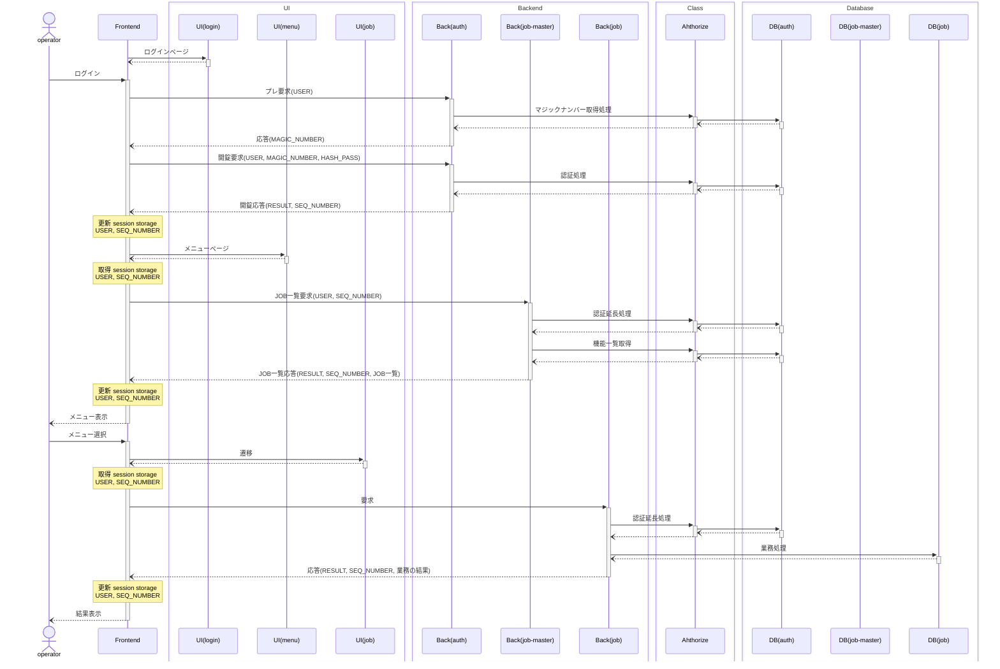

```mermaid
sequenceDiagram
  actor HM as operator
  participant FR as Frontend

  box UI
    participant LG as UI(login)
    participant MN as UI(menu)
    participant JB as UI(job)
  end

  box Backend
    participant BA as Back(auth)
    participant BM as Back(job-master)
    participant BJ as Back(job)
  end

  box Class
    participant CA as Ahthorize
  end

  box Database
    participant DA as DB(auth)
    participant DM as DB(job-master)
    participant DJ as DB(job)
  end

  FR ->>+ LG: ログインページ
  LG --)- FR:

  HM ->>+ FR: ログイン
  FR ->>+ BA: プレ要求(USER)
  BA ->>+ CA: マジックナンバー取得処理
  CA ->>+ DA:
  DA --)- CA:
  CA --)- BA:
  BA --)- FR: 応答(MAGIC_NUMBER)

  FR ->>+ BA: 開錠要求(USER, MAGIC_NUMBER, HASH_PASS)
  BA ->>+ CA: 認証処理
  CA ->>+ DA:
  DA --)- CA:
  CA --)- BA:
  BA --)- FR: 開錠応答(RESULT, SEQ_NUMBER)
  note over FR: 更新 session storage<br>USER, SEQ_NUMBER

  FR ->>+ MN: メニューページ
  MN --)- FR:
  note over FR: 取得 session storage<br>USER, SEQ_NUMBER
  FR ->>+ BM: JOB一覧要求(USER, SEQ_NUMBER)
  BM ->>+ CA: 認証延長処理
  CA ->>+ DA:
  DA --)- CA:
  CA --)- BM:
  BM ->>+ CA: 機能一覧取得
  CA ->>+ DA:
  DA --)- CA:
  CA --)- BM:
  BM --)- FR: JOB一覧応答(RESULT, SEQ_NUMBER, JOB一覧)
  note over FR: 更新 session storage<br>USER, SEQ_NUMBER
  FR --)- HM: メニュー表示

  HM ->>+ FR: メニュー選択
  FR ->>+ JB: 遷移
  JB --)- FR:
  note over FR: 取得 session storage<br>USER, SEQ_NUMBER
  FR ->>+ BJ: 要求
  BJ ->>+ CA: 認証延長処理
  CA ->>+ DA:
  DA --)- CA:
  CA --)- BJ:
  BJ ->>+ DJ: 業務処理
  DJ --)- BJ:
  BJ --)- FR: 応答(RESULT, SEQ_NUMBER, 業務の結果)
  note over FR: 更新 session storage<br>USER, SEQ_NUMBER
  FR --)- HM: 結果表示

```
