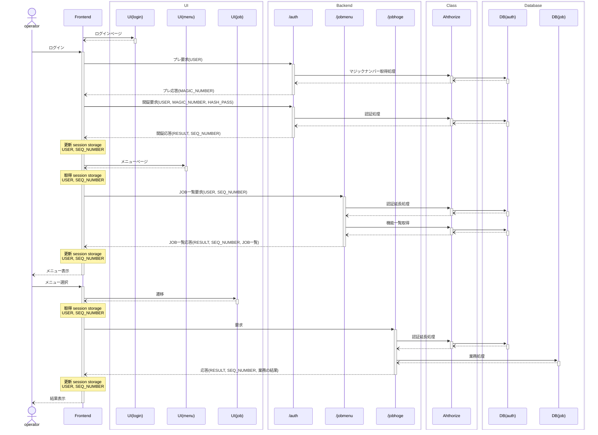

### シーケンス

### インタフェース

#### プレ要求
| No. | 項目名 | 型 | 説明 |
|:---:|--- |--- | --- |
| 1 | USER | string | 試行ユーザ名 |

#### プレ応答
| No. | 項目名 | 型 | 説明 |
|:---:|--- |--- | --- |
| 1 | RESULT | boolean | 結果(True/False) |
| 2 | DETAIL | string | 結果がFalseだった場合に詳細情報を設定 |
| 3 | MAGIC_NUMBER | number | マジックナンバ |

#### 開錠要求
| No. | 項目名 | 型 | 説明 |
|:---:|--- |--- | --- |
| 1 | USER | string | 試行ユーザ名 |
| 2 | MAGIC_NUMBER | number | マジックナンバ |
| 3 | HASH_PASS | string | ハッシュ化パスワード |

#### 開錠応答
| No. | 項目名 | 型 | 説明 |
|:---:|--- |--- | --- |
| 1 | RESULT | boolean | 結果(True/False) |
| 2 | DETAIL | string | 結果がFalseだった場合に詳細情報を設定 |
| 3 | SEQ_NUMBER | number | シーケンス管理ナンバ |

#### 要求（一般系）
| No. | 項目名 | 型 | 説明 |
|:---:|--- |--- | --- |
| 1 | USER | string | 試行ユーザ名 |
| 2 | SEQ_NUMBER | number | シーケンス管理ナンバ |
| : | 
:
 | 
:
 | 以降、業務データ |

#### 応答（一般系）
| No. | 項目名 | 型 | 説明 |
|:---:|--- |--- | --- |
| 1 | RESULT | boolean | 結果(True/False) |
| 2 | DETAIL | string | 結果がFalseだった場合に詳細情報を設定 |
| 3 | SEQ_NUMBER | number | シーケンス管理ナンバ |
| : | 
:
 | 
:
 | 以降、業務応答 |
