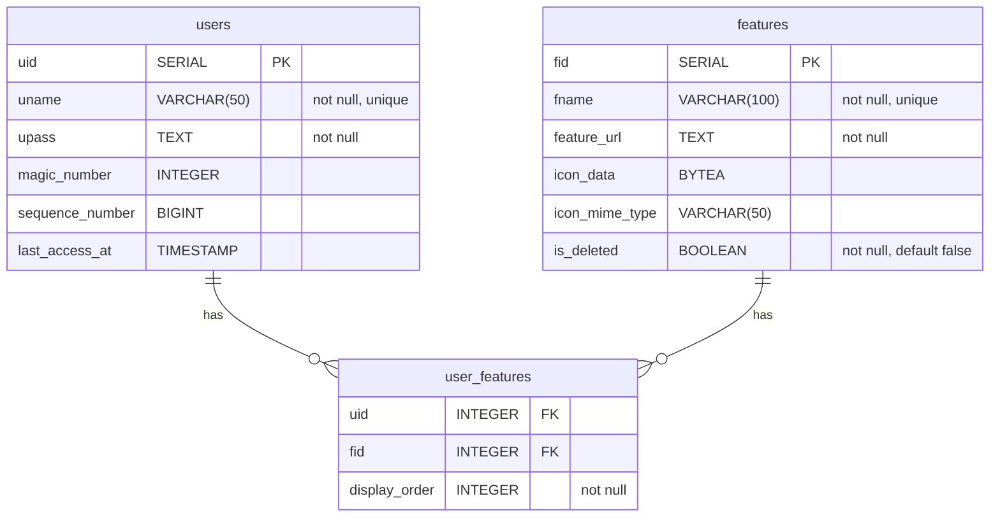

### テーブル

```mermaid
erDiagram
    users {
      uid SERIAL PK
      uname VARCHAR(50) "not null, unique"
      upass TEXT "not null"
      magic_number INTEGER
      sequence_number BIGINT
      last_access_at TIMESTAMP
    }

    features {
      fid SERIAL PK
      fname VARCHAR(100) "not null, unique"
      feature_url TEXT "not null"
      icon_data BYTEA
      icon_mime_type VARCHAR(50)
      is_deleted BOOLEAN "not null, default false"
    }

    user_features {
      uid INTEGER FK
      fid INTEGER FK
      display_order INTEGER "not null"
    }

    users ||--o{ user_features : has
    features ||--o{ user_features : has
```
